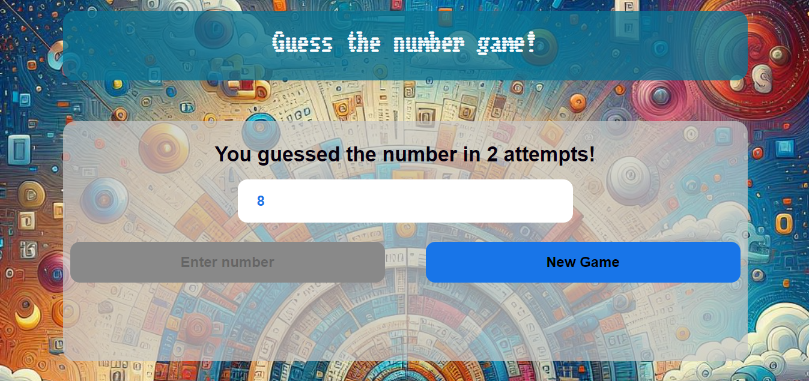

# Guess the Number 🎮

Welcome to Guess the Number, an interactive game built with JavaScript, CSS, and HTML. Test your numeric skills and have fun trying to guess the secret number in three exciting difficulty levels.

## Key Features

- **Three Difficulty Levels:**
  - 🌟 **Easy:** 1 to 10.
  - 🚀 **Medium:**   1 to 100.
  - 🔥 **Hard:** 1 to 1000.

- **User-Friendly Interface:**
  - Intuitive design for a seamless gaming experience.

- **Real-Time Feedback:**
  - Instantly find out if the secret number is higher or lower.

- **Limited Attempts:**
  - Challenge yourself! Each level has a specific number of attempts.

## How to Play

1. Clone this repository or download the source code.
2. Open the `index.html` file in your web browser.
3. Select your preferred difficulty level.
4. Guess the number and test your numeric skills!

## Results and Celebration

At the end of each game, it will be revealed if you guessed correctly and in how many attempts. Celebrate your victories and keep improving!

## Screenshots

Have Fun Guessing and Challenging Your Intuition Skills! 